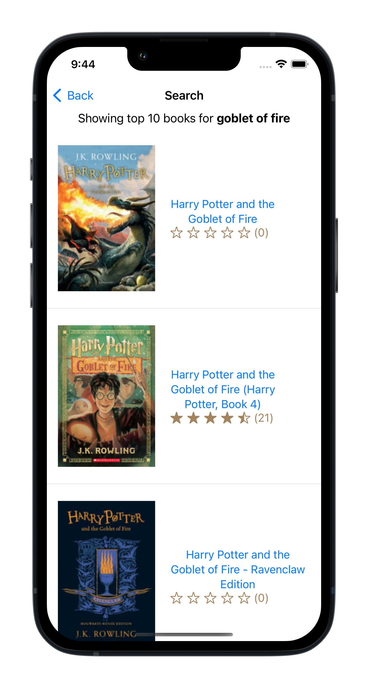

# Biblio - Book Search App 📚

Biblio is a native iOS application that allows users to search for any books and view the search results along with detailed information about the books. The app utilizes the Google Books API to perform book searches and fetches relevant data.

## Features

- Search for Books: Users can enter book titles, authors, or keywords to search for books.
- View Search Results: The app displays a list of search results based on the user's query.
- Book Details: Users can tap on a book from the search results to view detailed information about the book, including the title, author, ratings, description, pages, ebook availability, country of publishing and cover image.

## Screenshots

1. Home Screen

2. Search Results

3. Book Details

## Technologies Used

- SwiftUI: The app is completely written in SwiftUI.
- Google Books API: The app uses the Google Books API to perform book searches and fetch book data.

## Getting Started

To run the app locally on your iOS device, follow these steps:

1. Clone the repository to your local machine:
`git clone https://github.com/maha0134/biblio.git`

2. Open the `Biblio.xcodeproj` file using Xcode.

3. Build and run the app on your iOS device or simulator.

## How to Contribute

Contributions to Biblio are welcome! If you'd like to contribute to the project, follow these steps:

1. Fork the repository.

2. Create a new branch for your feature or bug fix.

3. Make your changes and commit them.

4. Push your changes to your fork.

5. Submit a pull request to the `main` branch of the original repository.

## Acknowledgments

- The Biblio app was inspired by my love for books and my desire to create a simple and efficient book search tool.
- Thanks to Google for providing the Google Books API, which powers the search functionality of the app.

## Contact

If you have any questions or suggestions regarding Biblio, feel free to contact me through my linkedIn (check github profile).

Happy reading with Biblio! 📚📖🔍
